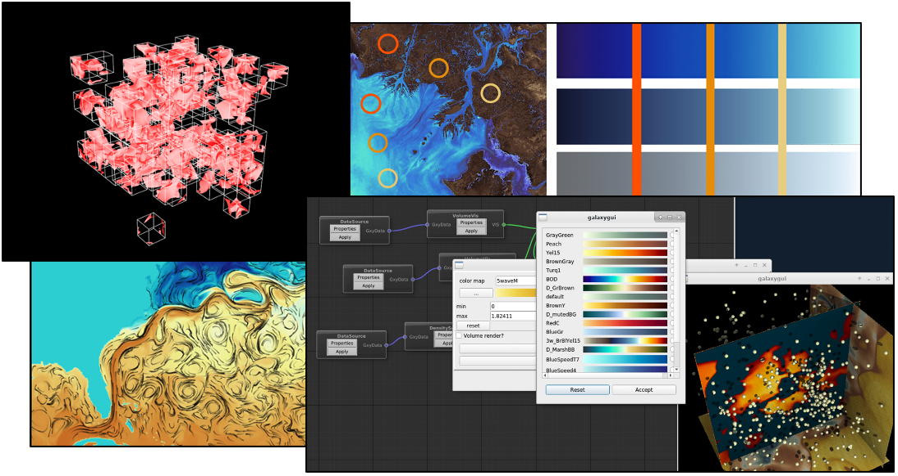

This is the home page for the Stardust Science project, an asynchronous rendering research project. This project is a joint effort among **Los Alamos National Laboratory**, **The University of Texas at Austin** and **The University of New Hampshire**. 

The Stardust project has resulted in a range of publications, open source software capabilities, and web content that embodies the novel research done by the team. These include:

- **Galaxy** engine, a platform to explore asynchronous rendering and sampling algorithms. Galaxy can be downloaded from the [Stardust Science github](http://www.github.com/stardustscience)

- **Andromeda** prototype, a platform to explore a streaming approach to rendering and sampling massive data. Andromeda can be downloaded from the [Stardust Science github](http://www.github.com/stardustscience)

- [**SciVisColor.org**](http://www.sciviscolor.org), a website that organizes work about approaches to coloring scientific datasets.

- Stardust publications are listed [here](publications).

{:width="200px"}
{:width="200px" .center-image}
{:width="200px"}

